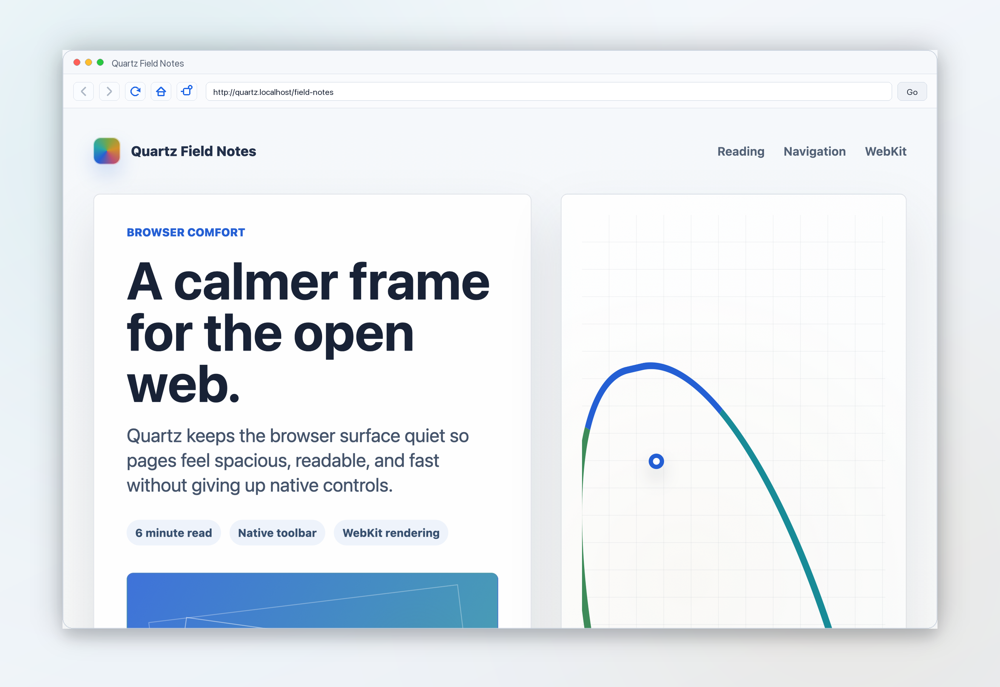
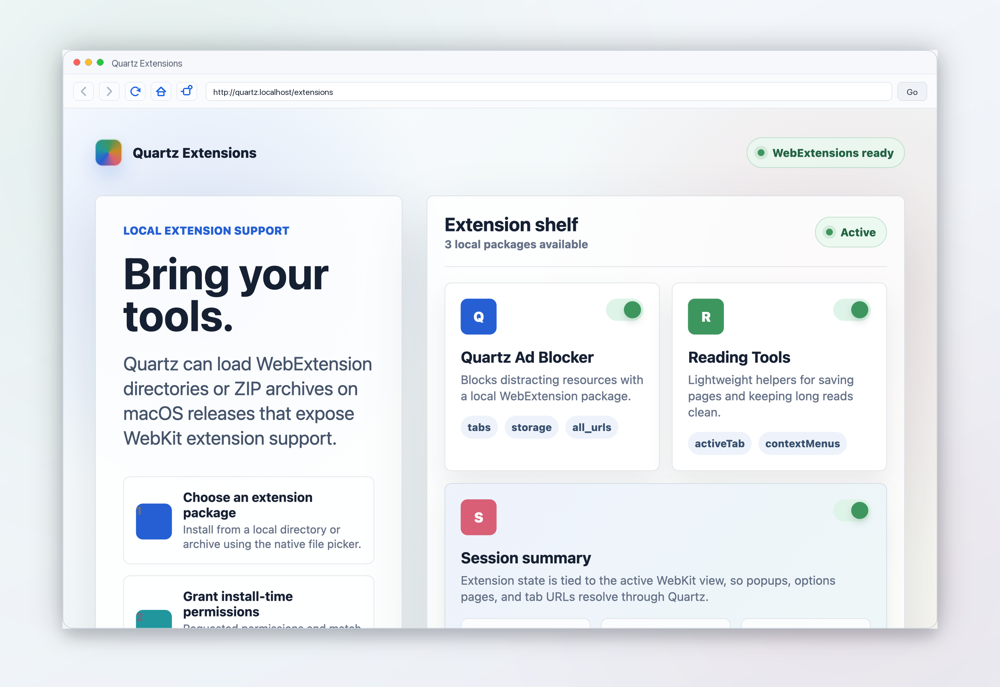

# Quartz

A native macOS web browser.

## Screenshots

<p>
  
</p>

<table>
  <tr>
    <td></td>
    <td></td>
  </tr>
</table>

## Run

```sh
swift run Quartz
```

## Build

```sh
swift build
```

## Features

- WebKit-powered browsing
- Optional WebExtension installation from local extension directories or ZIP archives on macOS 15.4+
- Address/search field
- Back, forward, reload, stop, and home controls
- Basic keyboard menu items

## Extensions

Quartz does not ship with a built-in ad blocker. Users can opt into extensions with **Extensions > Install Extension...** and choose a WebExtension directory or ZIP archive.

The former bundled ad-blocking filters now live in a separate Quartz Ad Blocker extension package.
