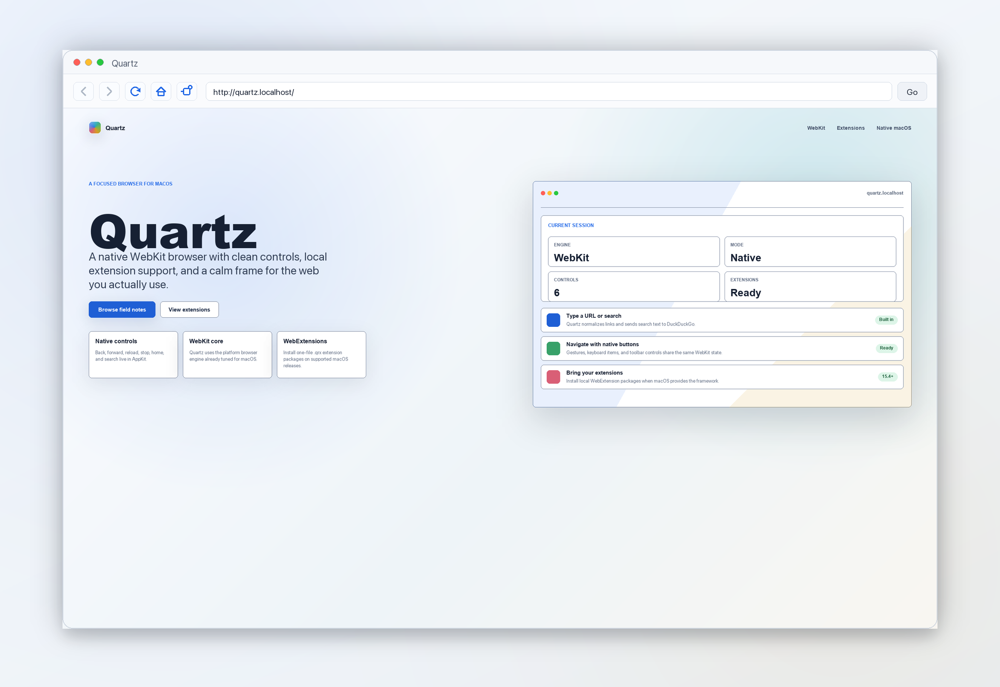
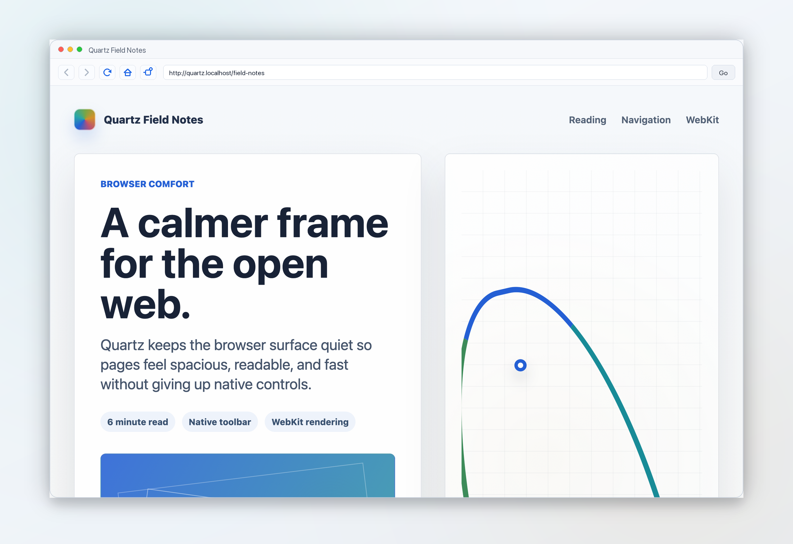
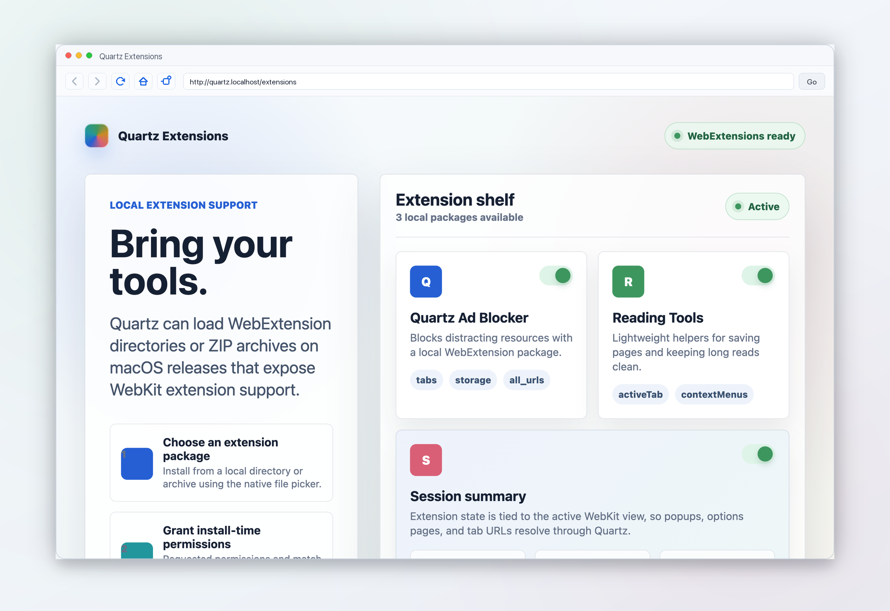

# Quartz


A native macOS web browser.

## Screenshots

<p>
  
</p>

<table>
  <tr>
    <td></td>
    <td></td>
  </tr>
</table>

## Run

```sh
swift run Quartz
```

## Build

```sh
swift build
```

## Package

Create a local macOS app bundle:

```sh
Scripts/package-macos-app.sh
open dist/Quartz.app
```

The default package is ad-hoc signed for local development. If macOS blocks a downloaded ad-hoc build with "Apple could not verify...", remove the quarantine attribute from the copy you trust:

```sh
xattr -dr com.apple.quarantine /path/to/Quartz.app
```

The automated release workflow uses free Ed25519 update signing without an Apple
Developer account; see [update setup](docs/UPDATES.md). The
[release checklist](docs/releases.md) covers universal app and ZIP verification,
local ad-hoc testing, and the separate Developer ID signing and notarization
process, including rebuilding the ZIP after stapling.

## Features

- WebKit-powered browsing
- Multiple native browser windows, including extension-created pages
- Colorful local home page at `quartz://home` with search, discoveries, Facet, and extensions
- In-browser updates with verified downloads, progress, and automatic restart
- Tiny built-in ad blocker for obvious third-party ad resources
- Reading mode for article-focused pages
- File downloads with a native save dialog and completion feedback
- Facet side-panel assistant powered by OpenRouter
- Optional Chromium-format WebExtension installation on macOS 15.4+, including Chrome Web Store downloads
- Address/search field
- Back, forward, reload, stop, home, reading, and Facet controls
- Basic keyboard menu items

## Home Page


[View the home page in dark mode](docs/screenshots/home-dark.png).

Visit `quartz://home` for a colorful launchpad with web search, quick links, and things to discover. The page is built into Quartz and works offline; opening a website or searching connects to the web. Its search box uses the same URL and DuckDuckGo search routing as the native address field, with direct access to the Facet panel and Extensions menu.

Choose a Daydream, Orbit, or Golden color mood, spin the quartz crystal, or shuffle a daily curiosity spark for something new to explore. Home follows the system’s light/dark appearance and Reduce Motion preference.

The Home button and new windows open `quartz://home`, and the older `quartz://start` address still works. Quartz also opens Home when there is no saved browsing session; a valid saved web or file URL takes precedence at launch.

Use **File > New Window** or **Command-N** to open another browser window.
Extensions that request a new tab or window also receive a separate window,
keeping the source page open.

## Reading Mode

Use the reading toolbar button or **Shift-Command-R** on an article page to show
its text and images with simpler formatting. Toggle it again to return to the
original page. Pages without enough article text remain unchanged.

## Downloads

When a website sends a file attachment or you follow a supported download link,
Quartz opens a native **Save Download** dialog. Choose a destination and save, or
cancel to leave the destination unchanged. After a successful transfer, the
**Download complete** message offers **Done** and **Show in Finder**. A failed
transfer shows an error instead of reporting a completed file.

## Updates

Release builds check for updates about once an hour while Quartz is running. When a compatible update is available, an **Update & Restart** button appears in the browser toolbar. Click it to download, verify, and install the update, then restart Quartz and restore your current page. Download and installation progress appear in the browser. You can cancel while checking or downloading; installation starts only after you choose to update.

Use **Quartz > Check for Updates…** to check immediately, or turn off **Quartz > Automatically Check for Updates** to disable automatic checks. Your existing preference is preserved. Manual checks still work when automatic checking is off.

[Sparkle](https://sparkle-project.org/) verifies the signed release feed and the update archive before extraction. A failed check or download shows an explanation and can be retried. Quartz keeps browsing data, extensions, and settings outside the app bundle, and the updater replaces the app itself.

Update requests go to GitHub without browsing history or Facet data. Running with `swift run Quartz`, or packaging without an update signing key, provides a development build with updates unavailable. Existing releases that predate the updater need one manual installation of an updater-enabled release. Maintainers can find signing, release setup, and verification instructions in [docs/UPDATES.md](docs/UPDATES.md).

## Facet

Facet is a docked AI assistant panel inside Quartz, powered by OpenRouter. Open it from the sparkles toolbar button or **View > Show Facet**. Create an [OpenRouter API key](https://openrouter.ai/settings/keys), enter it in the secure API key field, and click **Save** to store it in your macOS Keychain. **Remove** deletes the saved key. Facet can also use `OPENROUTER_API_KEY` from the environment that launches Quartz when no saved key is available.

Choose an OpenRouter model and an optional reasoning level, then ask a question. The default model uses OpenRouter's automatic routing; the default reasoning option lets the model use its own settings. Available models and supported reasoning options depend on OpenRouter and the selected provider.

Facet sends your prompt and recent conversation to OpenRouter and the selected model provider. When **Current page** is enabled, the request also includes the active page URL, title, selected text, description, and a bounded visible-text excerpt. Turn **Current page** off to omit that page context from future requests.

## Extensions

Quartz installs Chromium-format WebExtensions from the Chrome Web Store, an unpacked extension folder, a `.zip` archive, or a `.crx` package.

Users can opt into extensions from a Chrome Web Store listing with the native **Install** button that appears in the Quartz toolbar, or with **Extensions > Install This Web Store Extension**. Users can also choose **Extensions > Install from Chrome Web Store...** and paste a store listing URL or extension ID. Local packages are still available through **Extensions > Install Extension from File...**. Quartz copies installed extensions into Application Support and restores them on launch.

Quartz asks before granting an extension browser permissions or website access.
Use **Extensions > Manage Extensions…** to enable, disable, or uninstall installed
extensions. Uninstalling preserves your original source file or folder.

Quartz includes a tiny built-in blocker for a few obvious third-party ad resources. The former larger bundled ad-blocking filters now live in a separate Quartz Ad Blocker extension package.

Extension authors can follow the [packaging guide](docs/extensions.md) and install
the [Hello Quartz sample](examples/extensions/hello-quartz). It includes an offline
Manifest V3 popup with no permissions. WebExtensions require macOS 15.4 or newer.
