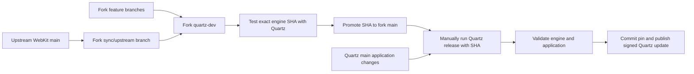

# Maintaining the Quartz WebKit fork

Quartz has two development histories and one shipped application. Maintain engine
changes in `QuartzBrowser/WebKit`, test selected engine commits with Quartz, and
publish a batch only when a maintainer runs Quartz's `release` workflow. Ordinary
commits, merges, engine promotions, and candidate builds do not publish Quartz.

This manual is the operating procedure for the workflows committed alongside it.
It takes effect for GitHub's default branch when those workflow changes are
merged into Quartz `main`. Editing a local copy of this document does not change
GitHub's triggers, cancel an already queued run, or prove that a candidate passed its release checks.

## Contents

- [The rules that matter](#the-rules-that-matter)
- [Repositories, branches, and immutable revisions](#repositories-branches-and-immutable-revisions)
- [What triggers a build or publication](#what-triggers-a-build-or-publication)
- [Set up an engine development checkout](#set-up-an-engine-development-checkout)
- [Make and maintain custom changes](#make-and-maintain-custom-changes)
- [Bring in upstream WebKit changes](#bring-in-upstream-webkit-changes)
- [Validate an engine candidate with Quartz](#validate-an-engine-candidate-with-quartz)
- [Promote a tested engine batch](#promote-a-tested-engine-batch)
- [Publish a Quartz release deliberately](#publish-a-quartz-release-deliberately)
- [Release planning and failure recovery](#release-planning-and-failure-recovery)
- [Revert a bad change without rewriting history](#revert-a-bad-change-without-rewriting-history)
- [Caches, builds, and evidence](#caches-builds-and-evidence)
- [Maintenance cadence](#maintenance-cadence)
- [Records and checklists](#records-and-checklists)
- [Permissions and repository settings](#permissions-and-repository-settings)
- [Troubleshooting and FAQ](#troubleshooting-and-faq)
- [Decision record](#decision-record)

## The rules that matter

1. Commit and experiment on engine `feature/*` branches based on `quartz-dev`.
2. Merge upstream WebKit into an engine `sync/upstream-*` branch based on
   `quartz-dev`; resolve, review, and test there before integration.
3. Preserve upstream ancestry and published fork history. Do not reset the fork
   to upstream, force-push the long-lived branches, or squash an upstream sync.
4. Test the exact engine SHA with the intended Quartz code. A green run for a
   different commit is useful context, but does not validate the new candidate.
5. Promote a tested engine revision to fork `main` when it is ready for shipping.
   Promotion makes it eligible; publication still needs an explicit action.
6. In **Quartz > Actions > release > Run workflow**, select Quartz `main` and
   supply the promoted full engine SHA. Leave it empty to keep Quartz's existing
   committed engine pin.
7. Let the release job validate, commit the pin, version, package, sign, and
   publish. Record its actual result and the public-download verification.

Twenty custom commits and hundreds of upstream commits can become one promotion
and one Quartz release. Quartz's own `main` can also collect multiple application
changes before that release. Commit frequency is independent of release frequency.

## Repositories, branches, and immutable revisions

| Location | Role | Moves when |
| --- | --- | --- |
| `WebKit/WebKit`, remote `upstream`, branch `main` | Original WebKit development history | Upstream maintainers integrate changes. |
| `QuartzBrowser/WebKit`, remote `origin`, branch `quartz-dev` | Shared integration of Quartz customizations and accepted upstream updates | A feature or sync is reviewed and integrated. |
| Fork `feature/*` | Individual experiments and custom behavior | You work, test, and commit. |
| Fork `sync/upstream-*` | An upstream merge under review | You resolve conflicts and validate the combined engine. |
| Fork `main` | Engine revisions considered ready for Quartz release validation | You deliberately promote a tested batch. |
| `QuartzBrowser/Quartz`, branch `main` | Application changes eligible for the next release | Quartz changes are merged. |
| Quartz `WebKit.lock.json` | Exact engine source used by normal Quartz builds | A validated release update commits a selected revision, or an explicitly reviewed lock change is merged. |
| Quartz release tag, such as `v0.16.0` | Historical application source and engine pin associated with a version | semantic-release creates a release. |

`upstream/main` is a remote-tracking ref in your engine checkout, not a new branch
that needs to be published in the fork. The branch names in the two repositories
are independent: a Quartz application branch called `main` does not refer to
engine `main`.



The release selector accepts a complete **40-character lowercase hexadecimal Git
SHA**, not `main`, `quartz-dev`, a tag, or an abbreviated hash. The selected SHA
must be available from the public fork, must descend from Quartz's current pin,
and must be reachable from the fork's `main`. An older promoted commit can be
selected even if fork `main` has subsequently advanced, provided it still meets
those ancestry rules. The job does not substitute the latest engine tip.

A manual **build** accepts a forward candidate from a development or feature
branch before promotion. This separates testing eligibility from release
eligibility. Existing release pins and version tags remain the source of truth
for what users actually received.

## What triggers a build or publication

| Action | Quartz validation | Publishes Quartz? |
| --- | --- | --- |
| Push a WebKit feature, sync, or `quartz-dev` branch | No automatic cross-repository Quartz build; dispatch one when useful. | No. |
| Promote engine `quartz-dev` into engine `main` | Select its SHA for a Quartz candidate build or release. | No. |
| Open or update a Quartz pull request | Automatic `build` workflow using that PR's lock. | No. |
| Push or merge into Quartz `main` | Automatic `build` workflow using the committed lock. | No. |
| Run Quartz `build` manually with an engine SHA | Builds and tests that SHA in the runner's working tree. | No. |
| Run Quartz `release` on `main`, with `verify_version` empty | Validates the selected engine and Quartz source before semantic-release. | Yes, if there are releasable changes or an unpublished engine pin. |
| Run Quartz `release` with `verify_version` set and no engine SHA | Rechecks the existing latest release's downloads. | No. |
| Create an engine tag | No Quartz release trigger. | No. |

The workflow files are [build.yml](../.github/workflows/build.yml) and
[release.yml](../.github/workflows/release.yml). There is no scheduled polling or
push trigger in the release workflow. Existing workflows in the WebKit fork may
have their own CI behavior; the table describes Quartz's integration.

A `fix:` or `feat:` commit describes version impact. It does not press the
publication button. The release analyzes the accumulated Quartz commits since
the previous release through [release.config.cjs](../release.config.cjs).

## Set up an engine development checkout

Use a separate, full engine checkout for editing and history work. Quartz's build
cache is a shallow, sparse, clean checkout optimized for one pinned revision. It
is intentionally unsuitable as your long-lived editing repository and may omit
upstream test directories. The build helper also rejects an existing source
checkout with local changes, a different revision, or a different origin URL.

From a parent development directory, create a new clone if you do not already
have a suitable engine checkout. The example directory avoids whitespace because
WebKit's upstream Makefiles require whitespace-free source and raw build paths.
Cloning all of WebKit can take substantial storage and time.

```sh
git clone --branch quartz-dev https://github.com/QuartzBrowser/WebKit.git QuartzWebKit
cd QuartzWebKit
git branch --track main origin/main
git remote add upstream https://github.com/WebKit/WebKit.git
git fetch origin
git fetch upstream
git switch quartz-dev
```

For an existing clone, inspect `git remote -v` first and add `upstream` only if it
is absent. Create a local tracking branch only when it does not already exist:
`git branch --track main origin/main` or
`git branch --track quartz-dev origin/quartz-dev`. The explicit remote avoids
ambiguity between `origin/main` and `upstream/main`. If local `quartz-dev` already
exists, use `git switch quartz-dev` and `git pull --ff-only origin quartz-dev`.
Stop and review divergence instead of replacing local work.

The fork's default branch is `quartz-dev`; the fresh-clone command selects it
explicitly. Existing clones can refresh their symbolic default with
`git remote set-head origin -a`; this does not move your working branch.

The initial `quartz-dev` branch was created on 2026-09-13 at the existing fork
`main` revision `4a523b0b3d1ddf66abbf9ec9b6351248e57db73c`, preserving the already
integrated history. This is an initialization record, not a permanently current
branch tip. Inspect live refs before starting new work.

Before every merge, promotion, or release-related local operation, inspect:

```sh
git status -sb
git diff
git diff --cached
```

The merge and candidate commands below assume a clean tracked working tree and
index. Commit intended work on its branch or preserve it in another worktree
before proceeding. Do not discard unrelated changes to make the commands pass.
Stop when a command fails; resolve the stated condition before continuing.

## Make and maintain custom changes

### Start a feature

In the engine development checkout:

```sh
git switch quartz-dev
git pull --ff-only origin quartz-dev
git switch -c feature/my-engine-change
```

Develop the change and its regression coverage, commit focused changes, and push
that feature branch. Open a WebKit-fork pull request with base `quartz-dev` when
ready for review. Record both the behavior you want and the upstream behavior
being changed. For a UI-only Quartz feature, prefer an application change when
WebKit's public API can express the behavior; an engine patch creates an ongoing
upstream maintenance obligation.

Keep engine customizations small and localized where practical. Preserve normal
upstream behavior outside the Quartz-specific condition. Include the reason for
non-obvious opt-outs near the relevant code, and link the change to its ledger
entry. An experimental change that affects page capabilities or compatibility
should have a deliberate default and a way to test both configurations.

### Keep a customization ledger

Maintain a tracked `QUARTZ_PATCHES.md` in the fork as customizations evolve, or an
equivalent linked record in a dedicated fork documentation directory. The template
below is a starting format, not a claim that the existing patch inventory has
already been audited. Add an entry with every customization and update it during
every upstream sync.

```markdown
## QWK-001: Short behavior name

- Status: active / upstreamed / retired
- Owner:
- User-visible reason:
- First fork commit or pull request:
- Upstream issue or proposal, if any:
- Files / upstream subsystem:
- Configuration or public API condition:
- Expected behavior with the change enabled:
- Expected behavior with the change disabled or absent:
- Regression tests and exact commands:
- Manual reproduction and expected result:
- Latest upstream sync reviewed:
- Latest tested engine SHA and Quartz SHA:
- macOS / architecture / Xcode actually exercised:
- Potential conflict or API migration points:
- Removal condition:
- Last review outcome and evidence links:
```

The existing integration's documentation identifies Writing Tools opt-outs,
Quick Look lifecycle behavior, and the prevention of mixed system/fork engine
images as important compatibility obligations. Review them when the relevant
upstream AppKit/WebKit code changes. Their mention here does not assert a fresh
runtime test or replace an inventory of the actual fork commits.

A long-lived customization should have an explicit removal condition, such as
an accepted upstream fix or a public API becoming available. Before dropping it,
prove that the relevant regression still passes against the updated engine.
Keep the retired ledger entry so future maintainers can understand its history.

### Integrate a feature

Review the patch, run the relevant upstream tests in the full engine checkout,
and run the Quartz candidate checks below. Merge the completed feature into
`quartz-dev` using a normal merge when its commit-level history is useful. The
critical rule is to preserve shared and upstream history: never squash an
upstream synchronization or rewrite a commit already used as a Quartz pin.

After integration, obtain the new `quartz-dev` SHA and test that combined tree
before promotion. Separate green feature runs do not establish that their merged
result works together. Development branches can contain work for the next batch;
keep unrelated experiments out of the batch you intend to promote.

## Bring in upstream WebKit changes

### Prepare a sync branch

From the full engine development checkout, fetch both repositories and create a
branch for this integration attempt:

```sh
git fetch origin
git fetch upstream
git switch quartz-dev
git pull --ff-only origin quartz-dev
QUARTZ_SYNC_BRANCH="sync/upstream-$(date +%Y-%m-%d)-1"
git switch -c "$QUARTZ_SYNC_BRANCH"
git log --oneline HEAD..upstream/main
git merge --no-ff --no-commit upstream/main
```

Choose another suffix if that sync branch already exists. `--no-commit` gives you
an inspection point before recording the merge; `--no-ff` preserves that point
even when the branch can fast-forward. If Git reports that everything is already
up to date, there is no upstream merge to record. The intended upstream snapshot
is whatever `upstream/main` resolved to at this fetch, not a continually moving
source during the build.

### Resolve and review

If there are conflicts, inspect them and resolve the intended combined behavior:

```sh
git diff --name-only --diff-filter=U
git status --short
git diff --check
```

Review conflict resolutions file by file. Avoid taking all of `ours` or `theirs`
for the merge: that can silently lose upstream changes or Quartz behavior.
An automatically clean merge is only a text merge. It cannot prove that changed
upstream call ordering, ownership, entitlements, feature flags, or APIs still
match the assumptions in a custom patch.

For every active customization, check its touched subsystem, inspect upstream
changes in that area, rerun its regression, and record whether it remains needed.
Inspect any removed or renamed APIs, deployment target changes, minimum Xcode
changes, and framework/service layout changes. The Quartz lock, build scripts,
and packaging validation may need corresponding changes in a Quartz branch.
Do not lower metadata values simply to bypass a new toolchain requirement.

Stage each resolved path deliberately, inspect the staged merge, then commit it:

```sh
git diff --cached --stat
git diff --cached
```

Use `git add -- path/to/resolved-file` for the actual resolved files, and
`git commit` once the merge is resolved and reviewed. Run the relevant upstream
and Quartz validation, push the sync branch, and open a fork PR targeting
`quartz-dev`. Preserve the upstream merge commit when integrating that PR.
If abandoning an uncommitted merge, `git merge --abort` is appropriate only for
this clean-started merge; inspect its result and keep any independent work safe.

### Review the resulting batch

After the sync PR is integrated, fetch the fork and inspect what will be promoted:

```sh
git fetch origin
git log --oneline --first-parent origin/main..origin/quartz-dev
git diff --stat origin/main...origin/quartz-dev
git merge-base --is-ancestor origin/main origin/quartz-dev
```

The ancestry check must succeed before a fast-forward promotion. These summaries
help review the batch but do not replace inspecting the customization changes,
conflict resolutions, and test evidence. A huge upstream commit count is normal;
it is not a reason to erase the history.

## Validate an engine candidate with Quartz

### Record the exact candidate

In the engine checkout after fetching the intended branch:

```sh
git fetch origin
QUARTZ_ENGINE_REVISION="$(git rev-parse origin/quartz-dev)"
printf '%s\n' "$QUARTZ_ENGINE_REVISION"
```

Use the SHA of `origin/feature/my-engine-change` or `origin/sync/upstream-...` when
testing that branch instead. The candidate must already be pushed to the public
fork so the runner can retrieve it. Transfer the complete displayed SHA to your
Quartz checkout or the workflow input; shell variables do not follow you into a
new terminal automatically.

### Run hosted validation without publishing

On GitHub, open **QuartzBrowser/Quartz > Actions > build > Run workflow**. Select
the Quartz branch whose application changes you intend to test, enter the full
SHA in `engine_revision`, and run it. Leave `engine_revision` empty to test the
engine already pinned on that Quartz branch.

Equivalent GitHub CLI commands, from an authenticated shell:

```sh
QUARTZ_ENGINE_REVISION='PASTE_THE_FULL_LOWERCASE_ENGINE_SHA'
gh workflow run build.yml --repo QuartzBrowser/Quartz --ref main \
  -f engine_revision="$QUARTZ_ENGINE_REVISION"
gh run list --repo QuartzBrowser/Quartz --workflow build.yml --limit 5
gh run watch --repo QuartzBrowser/Quartz
```

Replace `main` with your Quartz candidate branch if application changes are part
of the experiment. Use the workflow run whose recorded application SHA and
engine input match your test, especially if someone else dispatches a build at
the same time. Builds share cancellation concurrency by Quartz branch; a newer
build on the same branch can cancel an older candidate. Use a dedicated Quartz
test branch when that isolation is useful. GitHub dispatch is asynchronous; command success means the run
was requested, not that validation passed.

The build workflow stages the candidate lock before preparing the engine,
validates the engine/bundling helpers, builds both architectures, runs Quartz
tests, packages and extracts the app, checks bundled runtime rendering/network
behavior, and tests updater signing/tamper rejection with disposable keys. It
does not commit the temporary pin, push it, or create a release. Runtime checks
exercise the host architecture; separate Intel and supported-OS runs remain
necessary to claim those combinations.

A successful explicit manual engine candidate run uploads the development app
and selection record as **quartz-webkit-candidate-RUN_ID**, retained for **7 days**.
The artifact contains `dist/Quartz.zip` and `.build/engine-candidate.json`; the JSON
records `quartz_revision`, `previous_revision`, and `revision`. The packaged
engine manifest carries the selected engine's provenance. The upload occurs only
after validation succeeds and only when the manual `engine_revision` input is
nonempty. Ordinary PR/main builds and manual builds with no engine input do not
upload this candidate artifact.

Download it through the run's **Artifacts** section, or use the exact run ID:

```sh
QUARTZ_CANDIDATE_RUN_ID='PASTE_THE_RUN_ID'
QUARTZ_CANDIDATE_DIR="$(mktemp -d -t quartz-engine-candidate)"
gh run download "$QUARTZ_CANDIDATE_RUN_ID" --repo QuartzBrowser/Quartz \
  --name "quartz-webkit-candidate-$QUARTZ_CANDIDATE_RUN_ID" \
  --dir "$QUARTZ_CANDIDATE_DIR"
cat "$QUARTZ_CANDIDATE_DIR/.build/engine-candidate.json"
ditto -x -k "$QUARTZ_CANDIDATE_DIR/dist/Quartz.zip" "$QUARTZ_CANDIDATE_DIR/unpacked"
"$QUARTZ_CANDIDATE_DIR/unpacked/Quartz.app/Contents/MacOS/Quartz" --quartz-webkit-info
```

Compare the recorded SHAs with your intended test before launching. The candidate
is ad-hoc signed and has development update settings; it is not a production
release. Follow the [packaged-app checks](releases.md#packaged-app-smoke-test) and
save evidence before artifact expiry. Gatekeeper behavior for downloaded ad-hoc
apps is described in the [local build checklist](releases.md#local-ad-hoc-build).

### Test locally or through a candidate lock pull request

In a clean Quartz checkout, first create a temporary application branch. The
helper verifies that the selected fork revision is forward from the current pin
and changes only `WebKit.lock.json` in the working tree:

```sh
git switch -c test/webkit-candidate
QUARTZ_ENGINE_REVISION='PASTE_THE_FULL_LOWERCASE_ENGINE_SHA'
python3 Scripts/update-webkit.py candidate --revision "$QUARTZ_ENGINE_REVISION"
git diff -- WebKit.lock.json
WEBKIT_ARCHS=arm64 Scripts/build-webkit.sh
Scripts/quartz.sh test
QUARTZ_APP_ARCHS=arm64 Scripts/package-macos-app.sh
python3 Scripts/test-webkit-runtime.py dist/Quartz.app/Contents/MacOS/Quartz
```

These local commands are a faster Apple Silicon check. For universal validation,
run `Scripts/build-webkit.sh` and `Scripts/package-macos-app.sh` without those
architecture overrides, then follow the [release checklist](releases.md).
The script builds clean source at the selected SHA; it does not incorporate
uncommitted engine source edits from your separate development checkout.

For a shareable Quartz candidate branch, explicitly commit `WebKit.lock.json`
on that branch and open a Quartz pull request; PR CI then uses that pin. Keep
application changes needed by the engine in the same candidate branch. A test
PR may be left unmerged while you use its evidence to promote the engine and
select it in the release workflow. Candidate testing does not require committing
a lock change to Quartz `main`.

If you do merge an explicit lock update, review it as a production dependency
change, ensure its engine revision is promoted, and preserve the same evidence.
A normal release with an empty engine input will keep that committed pin.
Do not rely on the publication selector to repair an incorrectly reviewed
manually edited lock.

### Cover the intended behavior

In addition to the generic workflow, record the changed behavior in the packaged
browser. Exercise ordinary and error cases, multiple windows, networking,
downloads, extensions, and any affected page features. Use upstream regression
tests appropriate to the touched subsystem: the existing Quartz tests are not
the complete WebKit layout, JavaScriptCore, or API test suites. Refer to the
upstream checkout's `Tools/Scripts` and [WebKit testing guidance](https://docs.webkit.org/Build%20%26%20Debug/Tests.html)
for the supported commands for that revision.

A feature can be ready for integration before every shipping platform is tested.
Record exactly what passed and what remains unrun; resolve the release-relevant
gaps before declaring the batch ready for users.

## Promote a tested engine batch

Promotion moves fork `main` to the tested integration revision while preserving
its SHA. Avoid a squash or a new promotion merge commit, which would create a
revision different from the one you just tested.

In the full engine checkout, after reviewing a successful candidate run:

```sh
(
set -eu
git fetch origin
git switch main
git pull --ff-only origin main
QUARTZ_TESTED_ENGINE_REVISION='PASTE_THE_FULL_LOWERCASE_TESTED_SHA'
test "$(git rev-parse origin/quartz-dev)" = "$QUARTZ_TESTED_ENGINE_REVISION"
git merge --ff-only origin/quartz-dev
test "$(git rev-parse HEAD)" = "$QUARTZ_TESTED_ENGINE_REVISION"
git push origin main
)
```

The subshell stops at the first failed command without changing your interactive
shell's options. Stop if either `test` fails: development advanced after your
validation, or you selected the wrong revision. Test the new combined tip before promoting it.
Stop if the fast-forward fails and reconcile why `main` contains separate work;
do not force-push it to make the branch names line up. If the remote changes
between fetch and push, the ordinary push must refuse a non-fast-forward update.

Inspect the pushed result and preserve the tested SHA:

```sh
git fetch origin
git rev-parse origin/main
```

This push makes the engine eligible for a release input. It does not change
Quartz's committed lock, publish a GitHub release, or update an installed app.
A release may still reject or fail the candidate during final validation.

An annotated engine tag is optional provenance, for example a consistently named
`quartz-engine-*` tag recorded in the batch log. Create it only for the intended
exact SHA. The Quartz selector uses the SHA, not the tag; there is no requirement
to create separate WebKit GitHub releases or distribute a standalone engine ZIP.

## Publish a Quartz release deliberately

### Choose the release inputs

Open **QuartzBrowser/Quartz > Actions > release > Run workflow** and select
Quartz branch **main**. The inputs have separate meanings:

| Input | Value | Result |
| --- | --- | --- |
| `engine_revision` | Empty | Keep `WebKit.lock.json` exactly pinned to its committed revision. New fork commits are ignored. |
| `engine_revision` | Full promoted 40-character lowercase SHA | Select that exact forward engine revision for validation and publication. |
| `verify_version` | Empty | Run the normal release path. |
| `verify_version` | Existing latest release's numeric version, without `v` | Run public-download verification only; leave `engine_revision` empty. |

`engine_revision` and `verify_version` are mutually exclusive. Do not supply both.
A publication request targets Quartz `main`; a feature branch build belongs in
the `build` workflow. Workflow files supporting these inputs must already exist
on the default branch for the normal Run workflow experience.

### Publish application changes with the existing engine

```sh
gh workflow run release.yml --repo QuartzBrowser/Quartz --ref main
```

This intentionally does not ask GitHub for a newer engine tip. Pending Quartz
Conventional Commits determine the version. If there are no releasable application
changes and the current engine is already published, semantic-release may make
no new release; a successful no-op is not a newly published version.

### Publish a selected engine batch and pending application changes

```sh
QUARTZ_ENGINE_REVISION='PASTE_THE_FULL_LOWERCASE_PROMOTED_SHA'
gh workflow run release.yml --repo QuartzBrowser/Quartz --ref main \
  -f engine_revision="$QUARTZ_ENGINE_REVISION"
gh run list --repo QuartzBrowser/Quartz --workflow release.yml --limit 5
gh run watch --repo QuartzBrowser/Quartz
```

Check the run's application SHA and engine plan. The workflow captures the Quartz
revision associated with the dispatch and builds that application tree. If
Quartz `main` advances during validation, the commit gate stops the run instead
of rebasing the validated result onto untested application changes. Dispatch a
fresh release after reviewing the new main state.

Do not repeatedly press Run workflow to hurry a build. Release runs are
serialized; duplicate requests can wait, become stale, or require a fresh run
once main has moved. A slow uncached engine build is not a reason to bypass the
validation sequence.

Engine-only batches produce an automatically generated `fix(webkit)` commit and
therefore a Quartz patch release. A batch containing Quartz `feat:` commits can
produce a minor release; breaking changes can require a major release. An engine
change's feature impact is not inferred from every upstream commit. If a fork
feature warrants a different public version impact, describe that deliberately
in the accompanying Quartz Conventional Commit and release notes.

Users receive the engine embedded in the normal signed Quartz update. They do
not select an engine branch, compile WebKit, or install a separate engine release.
The exact source pin and license notices stay with the distributed app.

## Release planning and failure recovery

### What the workflow does

The sequence in [release.yml](../.github/workflows/release.yml) and
[update-webkit.py](../Scripts/update-webkit.py) is:

1. Snapshot the selected Quartz `main` revision and plan the exact engine input.
2. Validate revision format and ancestry. Read the latest stable Quartz release's
   lock to determine whether this engine has already been published.
3. Stage the candidate lock in the runner's working tree.
4. Restore only a matching verified engine cache or build the candidate. Run the
   required tests, packaging/runtime checks, and updater fixture checks.
5. Recheck that the application source and remote Quartz `main` still match the
   plan. Commit only the validated lock change, or an empty engine-publication
   retry commit when needed, and push without rewriting history.
6. Run semantic-release in the same job, generating release metadata, packaging
   the universal app, signing the final archive/feed with the existing Sparkle
   key, and publishing the GitHub release and its assets.
7. Download the public assets afresh, compare them with the prepared bytes,
   verify checksums and the extracted app's code signature, verify the update
   archive against the embedded key/version/download URL, and compare the stable
   latest-feed route. This public audit does not launch the engine again; the
   packaging/runtime checks occur earlier. Inspect each gate's logged results.

The script's local planning mode is read-only. From a Quartz checkout with all
release tags fetched, these commands let you inspect the selector without
starting an expensive build or publishing anything:

```sh
git fetch origin --tags
python3 Scripts/update-webkit.py plan
QUARTZ_ENGINE_REVISION='PASTE_THE_FULL_LOWERCASE_PROMOTED_SHA'
python3 Scripts/update-webkit.py plan --revision "$QUARTZ_ENGINE_REVISION"
```

The default plan retains the committed pin. `--revision` is the explicit
promoted-engine selector. The `release_required` field concerns engine
publication; `false` does not mean there are no pending releasable application
commits. Planning can fail when tags for the latest published release are
missing locally, when the GitHub API is unavailable, or when ancestry is invalid.

The lower-level `stage --plan` and `commit --plan` commands exist for the workflow's
validated transaction. `commit` can push Quartz `main`; it is not a dry run or a
shortcut around the required tests. Use the candidate command for experiments
and the manual workflow for publication.

### Respond according to the failure stage

| Observed result | What may have changed | Next action |
| --- | --- | --- |
| Invalid input, unpublished candidate, or bad ancestry | No release pin committed. | Select the correct SHA, promote it if appropriate, or fix the history on a new forward branch. |
| Engine build, tests, or pre-commit package verification fail | The runner's temporary candidate may exist; the release path has not committed that candidate pin. | Fix the cause, produce/test a new candidate where required, and dispatch a fresh run. |
| Quartz `main` moved during validation | The tested candidate is not committed by the stale plan. | Review the new application changes and dispatch again against the new main revision. |
| Pin commit succeeded but publication failed | Quartz main may already contain the validated engine pin; release tags/assets may be incomplete depending on the failing step. | Inspect main, tags, assets, and logs before retrying publication. |
| Release published but public-download verification failed | Users may already be offered the published release. | Recheck the published version using `verify_version`; investigate persistent mismatches. |
| Recheck-only run passed | Existing public release was verified again. | Record the result; no new version was created. |

Retries are deliberate. Use **Run workflow** to create a fresh dispatch against
the current Quartz main, rather than rerunning an old source snapshot. Historical
workflow reruns use historical code: rerunning a workflow from before this policy
change can execute the old automatic engine-selection/publication path. Inspect
old queued or in-progress runs during the transition; changing the workflow file
does not cancel those jobs. There is no five-minute retry schedule. When the pin
commit exists but the latest published release still lacks that engine, a fresh
manual release can create an empty `fix(webkit)` commit so semantic-release has
a releasable engine change. This retry logic is conditional on actual published
state, not on an assumption that the previous run completed. Recheck after any
partial tag or draft-release failure and resolve inconsistent release metadata
before retrying; do not blindly delete tags or overwrite signed assets.

For a latest release that published successfully but failed the public audit:

```sh
QUARTZ_RELEASE_VERSION='0.16.0'
gh workflow run release.yml --repo QuartzBrowser/Quartz --ref main \
  -f verify_version="$QUARTZ_RELEASE_VERSION"
```

Replace the example version with the actual latest published version, without
`v`, and leave the engine input empty. This path downloads and verifies existing
assets; it does not rebuild or replace them. A normal no-op release rerun may
skip the public audit when no new version is published, which is why this
separate input exists. See [release verification](releases.md#automated-release-boundary)
for the exact checks and latest-feed propagation retries.

## Revert a bad change without rewriting history

Before publication, fix or revert the offending customization on a new branch
from the relevant integration state, retest it, and promote the replacement
forward revision. An older selected SHA can be used only if it still descends
from Quartz's currently committed pin and is reachable from fork `main`.

After publication, do not reset `main`, move a release tag, or repin Quartz to an
older engine SHA. Create a new engine commit that reverts the faulty behavior,
validate it, promote it, and publish a new Quartz version. This preserves the
updater's forward engine history and gives installed applications a higher
version to install.

For a single ordinary custom commit, work on a new feature/hotfix branch from
the appropriate current engine state and use:

```sh
git revert FULL_SHA_OF_THE_BAD_NON_MERGE_COMMIT
```

Choose the exact affected commit after inspecting its patch and dependencies.
Reverting a merge requires choosing the correct mainline parent and changes how
later merges are treated; investigate that history separately instead of copying
a generic `-m` command. Reverting an entire upstream sync may discard important
fixes, so prefer a focused regression fix when it is viable.

If `quartz-dev` contains unrelated unfinished work, create a hotfix branch from
fork `main`, test the fix against the release application tree, and fast-forward
`main` to that tested hotfix. Then merge the resulting fork `main` back into
`quartz-dev` before the next normal promotion. Preserve both histories and retest
the integration. The release's forward ancestry checks remain in force.

## Caches, builds, and evidence

### Separate development source from reproducible builds

Keep three different things distinct:

- A full engine editing checkout with branch history, local work, and regression
  tests.
- A clean source/raw-build cache per pinned revision under a whitespace-free
  path, used by `Scripts/build-webkit.sh`.
- Prepared engine products containing manifests, binary hashes, architecture
  information, source revision, and relocated framework/service dependencies.

The default local source/raw cache is
`~/Library/Caches/Quartz/WebKit/REVISION/`. Prepared products normally live at
`.build/quartz-webkit/products/Release` in the Quartz checkout. See the complete
[path and environment variable table](WEBKIT.md#build-the-engine). When retaining
multiple candidates, give them separate source, raw build, and products paths;
set `QUARTZ_WEBKIT_PRODUCTS_DIR` to the selected products for Quartz commands.
The directories must not overlap. Do not edit `QuartzWebKit.json` to pretend old
binaries came from a new source revision.

### Treat caches as acceleration

Hosted CI caches exact prepared engine products for the source/build/toolchain
identity and verifies a restored cache before use. A candidate build can warm a
usable cache, but that is not guaranteed: branch visibility rules, retention,
eviction, runner/toolchain changes, or changed build inputs can cause a miss.
An uncached universal build may take substantial time and disk space even when a
previous candidate built successfully. See [CI cache details](WEBKIT.md#ci-cache).

A cache is not a release archive. Preserve release assets and evidence separately.
Workflow logs and any Actions artifacts follow GitHub/repository retention and
can expire; save the evidence needed for a long-lived customization or release
record. A build's existence in the Actions list does not guarantee its outputs
remain available for later testing. Downloaded candidate packages, if supplied
by a workflow, are development artifacts until the publication pipeline signs
and verifies the actual release bytes.

### Record what each check establishes

| Evidence | Establishes | Does not establish by itself |
| --- | --- | --- |
| Python/shell helper tests | Selected validation, pin, packaging, and retry behaviors in fixtures. | A compiled engine or a working browser. |
| System-engine development tests | Quartz behavior against the installed Apple WebKit. | Compatibility with the custom fork. |
| Completed arm64 engine and Quartz test run | That tested source/toolchain combination on Apple Silicon. | Universal products or Intel runtime behavior. |
| Universal binary architecture checks | Both required slices are present. | Successful launch on both processor types. |
| Packaged engine diagnostic | Which engine images the launched process loaded and their provenance checks. | All content-process/networking behavior. |
| Packaged rendering/network smoke test | The exercised host's isolated page, JavaScript/layout, and loopback networking path. | The whole WebKit test suite or every real website. |
| Targeted upstream regression tests | The covered custom engine behavior for the selected configuration. | Uncovered browser integration paths. |
| Disposable updater signing/tamper tests | Fixture update creation and rejection behavior. | A successful production publication or installed-user upgrade. |
| Public-download verification | The checks actually logged against the published assets and URLs. | Every supported hardware/OS combination or a complete in-app upgrade exercise. |

Use [WEBKIT.md](WEBKIT.md) for build/runtime mechanics,
[releases.md](releases.md) for packaging/platform verification, and
[UPDATES.md](UPDATES.md) for signing and the actual update installation checks.

## Maintenance cadence

A reasonable starting policy is to review upstream activity each working day,
prepare small upstream sync batches regularly, and publish when the tested batch
is ready. Adjust the cadence to upstream change volume and available build
capacity. This is a maintainer routine, not a newly installed scheduled job.
Record the last reviewed upstream SHA/date and the current fork lag.

Treat relevant security fixes as a separate urgency decision. Check upstream
security information, affected functionality, and the actual commits available
to the fork; do not infer safety solely from a browser version label. When a fix
matters to Quartz, prepare and validate a focused forward update promptly rather
than waiting for the next feature batch. A selective cherry-pick may be suitable
for an urgent fix, but record the original upstream SHA, dependencies, conflicts,
and eventual reconciliation in the next full upstream merge.

For each sync, review the customization ledger and toolchain/deployment changes.
For each promotion, record the exact tested engine/app pair. For each publication,
review the release output and public-download result. Periodically retire
customizations upstream now supports, remove obsolete one-time cache migrations
when appropriate, and exercise a cold build so cache reuse does not conceal a
broken reproduction path.

## Records and checklists

### Upstream sync record

Copy this into the fork PR or its linked maintenance record:

```markdown
## Upstream sync

- Previous quartz-dev SHA:
- Upstream main SHA fetched:
- Resulting merge / integration SHA:
- Commit range reviewed:
- Customization ledger entries reviewed:
- Conflicts and resolution rationale:
- Customizations removed or replaced, with evidence:
- Toolchain / SDK / deployment / framework-layout changes:
- Upstream regression commands and results:
- Quartz candidate branch, SHA, and run URL:
- Runtime platforms exercised:
- Remaining gaps or blockers:
- Promotion decision:
```

### Engine promotion checklist

- [ ] The candidate descends from both current fork `main` and Quartz's current
  pinned engine revision.
- [ ] The intended upstream updates and custom changes are included; unrelated
  experiments are excluded from the batch.
- [ ] The customization ledger and conflict-resolution record are current.
- [ ] Required upstream regressions pass for the actual combined integration SHA.
- [ ] The Quartz candidate run records the exact engine/app SHA pair and passes
  the required build, tests, package, and runtime gates.
- [ ] Supported platform evidence and any unresolved limitations are recorded.
- [ ] Fork `main` fast-forwards to the tested SHA without history rewriting.
- [ ] The pushed SHA is verified and recorded. No publication is implied.

### Quartz publication record

Copy this into the release's maintenance record or linked issue/PR:

```markdown
## Quartz publication

- Requested date / maintainer:
- Quartz application SHA at dispatch:
- Previous committed engine pin:
- Selected engine SHA, or explicit keep-current-pin decision:
- Fork promotion evidence:
- Engine upstream base and customization summary:
- Candidate CI and targeted regression evidence:
- Release workflow URL and conclusion:
- Final Quartz release tag / source SHA:
- Published WebKit.lock.json revision:
- Published version, assets, and SHA256SUMS:
- Public-download verification run and outcome:
- Apple Silicon / Intel / macOS versions actually exercised:
- In-app update installation and restoration result:
- Checks still unrun and operational follow-up:
```

Do not put signing secrets or credential values in these records. Keep exact
asset bytes and logs wherever your release retention policy requires; a link to
an expired workflow artifact is not durable evidence.

## Permissions and repository settings

The Quartz workflow reads the public WebKit fork and uses Quartz's existing
`GITHUB_TOKEN` plus its existing Sparkle signing configuration for publication.
No cross-repository personal access token, engine publication webhook, or engine
GitHub release is required. Human fork pushes and Quartz workflow dispatches use
your normal GitHub access to those repositories.

Workflow dispatch requires the relevant GitHub repository permissions. The
release commit also needs permission to update Quartz `main`; if branch rules
block the existing automation, inspect that rule and choose a narrowly scoped
repository policy. Do not introduce a broad token just to bypass a failing gate.
The [update signing setup](UPDATES.md#one-time-repository-configuration) describes the existing
keys and the [release checklist](releases.md) explains the ad-hoc signing boundary.

On 2026-09-13, the fork's default branch was set to `quartz-dev`. Both `main`
and `quartz-dev` received protection that disallows force pushes and deletion,
including for administrators. Normal direct/fast-forward pushes remain allowed.
No required pull request reviews, required status checks, or push-actor
restrictions were added. The PR review, candidate validation, and promotion
checklists in this manual are maintainer procedures; the branch rules do not
mechanically prove those checks were performed.

Inspect the live rules before relying on that dated configuration. If adding
stricter rules later, align merge settings with preserved upstream ancestry and
fast-forward promotions; a blanket squash-only policy or required linear history
can conflict with real upstream merges. Required checks should be actual checks
that run for the protected branch, with the intended policy explicitly configured.
These fork protections do not change Quartz's application-branch permissions.

GitHub's [manual workflow instructions](https://docs.github.com/en/actions/how-tos/manage-workflow-runs/manually-run-a-workflow)
cover the UI, permissions, and CLI. Its [workflow event reference](https://docs.github.com/en/actions/reference/workflows-and-actions/events-that-trigger-workflows#workflow_dispatch)
explains dispatch behavior. The workflow definitions in this repository determine
which inputs and guards Quartz actually implements.

## Troubleshooting and FAQ

### I committed ten times. Did that create ten releases?

No. Neither fork pushes nor Quartz `main` pushes start the release workflow.
They can contribute to one later manually requested release. Quartz PR/main CI
still runs automatically so everyday integration receives validation.

### I promoted WebKit main. Why has my installed Quartz not changed?

Promotion only makes an engine revision eligible. Request a Quartz release with
that SHA, wait for successful publication/public verification, and install the
resulting Quartz update. An installed app uses its embedded engine, not a live
Git branch.

### I left engine_revision empty. Will it pick up the latest fork main?

No. Empty means keep the committed Quartz lock. Supply the complete promoted SHA
when you intentionally want an engine update. This applies even if fork `main`
is hundreds of commits ahead.

### Can I test a branch before it is on WebKit main?

Yes. Push its commit to the fork, then use Quartz's manual `build` input or the
local `candidate` command on a Quartz test branch. Publication selection adds
the fork-main reachability requirement.

### Can I type a branch name, a GitHub URL, or a short SHA?

No. Use the complete lowercase SHA returned by `git rev-parse` for the intended
commit. This avoids a branch moving between your decision and an expensive build.
Workflow input is passed as data through an environment variable; do not embed
shell commands or expressions in it.

### Why does the helper refuse a candidate with unrelated or older history?

Quartz requires forward ancestry from its committed pin. Fetch the right fork
refs and inspect the merge history. Fix the development history through reviewed
forward changes; resetting the lock or force-pushing a branch defeats that
contract. Published regression recovery uses a new revert/fix commit.

### Why does promotion fail after the candidate passed?

The development branch may have advanced, or fork `main` may contain a separate
hotfix. Reconcile that history, test the resulting combined SHA, and promote the
tested revision. Do not silently ship new commits because an older run was green.

### Why did the release say Quartz main changed?

The application changed after the release snapshot. That engine was validated
against a different app tree. Review the new Quartz head and dispatch a fresh
run. Avoid merging into Quartz `main` during a release if you want that run to
complete without becoming stale.

### Why did a release request finish without creating a version?

There may be no releasable Quartz commits and no unpublished engine revision.
Check the semantic-release output and latest release instead of counting a green
workflow as a release. Engine-only publication is represented by `fix(webkit)`;
ordinary documentation/chore changes may not require a new version.

### Does every upstream feat commit increase Quartz's version?

No. semantic-release analyzes Quartz's application history. The engine selector
represents the selected batch with one `fix(webkit)` commit. Describe any intended
Quartz feature/breaking impact deliberately in accompanying application commits.

### Can I make a separate WebKit release for every tested engine?

You can maintain optional tags or release records if useful, but Quartz neither
requires nor consumes engine GitHub releases. The lock's SHA and bundled engine
manifest identify the actual source. Avoid extra publication work without a
specific consumer or retention need.

### Can I edit the cached source checkout directly?

Use the full development clone for engine work. The default source cache is
shallow, sparse, and expected to be clean at an exact revision. Commit and push
engine changes, select their SHA, then let the build helper create a clean source
checkout. Use separate build paths when retaining older candidates.

### Why did candidate CI rebuild an engine that previously passed?

Prepared product reuse needs a compatible exact cache identity and access to the
cache under GitHub's rules. Eviction, retention, toolchain/runner differences,
and build-script changes can require a fresh build. Source equality alone does
not imply interchangeable binaries or cache availability.

### Is universal packaging proof that Intel works?

It proves the required slices are present when those checks pass. Runtime tests
run on the host architecture. Record an actual Intel run, Rosetta run, and tested
macOS versions separately; none is an automatic substitute for the others.

### Does a successful recheck publish a fixed app?

No. `verify_version` rechecks existing latest-release bytes. If the published app
itself needs correction, create a forward fix and publish a higher Quartz version.
Do not replace the signed ZIP with new bytes under the same version.

### Where do I look when documentation and GitHub disagree?

Inspect the workflow on the live default branch, the exact run's source SHA and
inputs, Quartz's committed lock, the fork's actual refs, and the release tag and
assets. Local edits, this manual, or an old green run do not prove current hosted
configuration or publication. Check for runs queued before a trigger change.

## Decision record

**Decision:** use `quartz-dev` for engine integration, preserve real upstream
merges, promote tested engine SHAs to fork `main`, and publish Quartz through a
manual workflow with an explicit engine selector. Keep normal CI automatic.

**Reason:** engine development, upstream synchronization, validation, and user
release each have different timing and evidence needs. A moving branch is useful
for collaboration; an immutable SHA is necessary for a reproducible candidate.
A deliberate publication action lets application and engine work collect into
reviewable batches without making every commit a release.

**Alternatives considered:** using engine `main` as an automatic publication
signal would keep promotion simple, but it would make a branch-management action
also start delivery. Scheduled polling of fork `main` would couple source drift
to expensive release builds and retry publication without a fresh decision.
A release per commit would produce needless updates and does not improve test
coverage. Replacing the fork with a repeatedly rebased patch stack would rewrite
shared history and conflict with the forward-only pin contract.

**Consequences:** maintainers must explicitly select engine upgrades and request
publication. There is no automatic upstream monitor or unattended publication
retry supplied by this change. A regular review routine matters, particularly
for security updates. Long-lived customizations require a regression inventory,
and upstream conflict resolution remains engineering work. Cache reuse can
reduce build cost but is not guaranteed. These are deliberate operating choices,
not hidden behavior in a commit hook.

**Review this decision when:** maintainers need a supported release branch for a
long-lived version, build capacity makes candidate testing impractical, upstream
changes require a different integration model, or reliable automated monitoring
with human-controlled publication becomes desirable. Preserve explicit source
selection and verifiable release gates in any replacement process.
